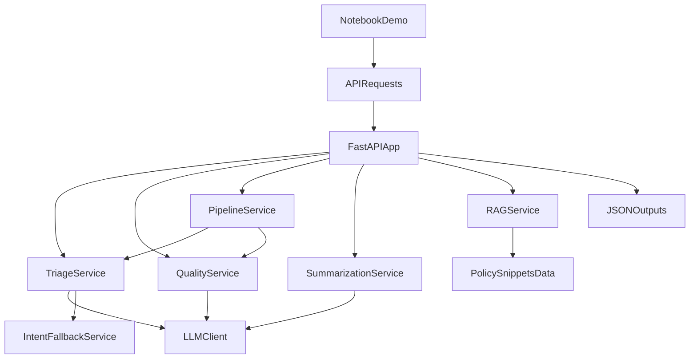

# LLM-Augmented Customer Support Triage & Quality Monitoring

FastAPI service that uses a **configurable LLM** (default: **hosted OpenAI-compatible APIs** like OpenRouter/NVIDIA) to triage support tickets, evaluate agent response quality, and summarize threads. Includes **lexical or embedding RAG**, **policy-grounded quality**, **hybrid triage** (TF–IDF+LR hint), **offline golden-set evaluation**, and a **Zendesk worker stub**. Typed, tested, observable, containerised, and CI-ready.

---

## Architecture

```
┌─────────────────────────────────────────────────────────────┐
│                        FastAPI  /api/v1                      │
│  ┌──────────┐    ┌──────────┐    ┌──────────────────────┐   │
│  │ /triage  │    │ /quality │    │     /pipeline        │   │
│  └────┬─────┘    └────┬─────┘    └──────────┬───────────┘   │
│       │               │                      │ (concurrent)  │
│  ┌────▼─────────────────────────────────────▼───────────┐   │
│  │              Service Layer                            │   │
│  │   TriageService  │  QualityService  │ PipelineService │   │
│  └────────────────────┬──────────────────────────────────┘   │
│                       │                                       │
│  ┌────────────────────▼──────────────────────────────────┐   │
│  │      LLMClient (OpenAI-compat / Anthropic)            │   │
│  │   • Retry (tenacity)  • JSON parsing  • Error mapping │   │
│  └───────────────────────────────────────────────────────┘   │
│                                                               │
│  ┌─────────────┐   ┌──────────────┐   ┌───────────────────┐ │
│  │ Redis Cache │   │  Prometheus  │   │  Structlog (JSON) │ │
│  └─────────────┘   └──────────────┘   └───────────────────┘ │
└─────────────────────────────────────────────────────────────┘
```

### Key design decisions

| Decision | Rationale |
|---|---|
| **Pydantic v2 models as single source of truth** | Enforces contract between layers; auto-generates OpenAPI docs |
| **LLM client decoupled via interface** | swap Anthropic for OpenAI-compatible api or local model without touching service logic |
| **Routing matrix in code, not LLM** | Deterministic, auditable, no hallucination risk on business rules |
| **Concurrent triage + quality in pipeline** | Halves wall-clock latency for the full workflow |
| **Redis cache on all endpoints** | Avoids redundant LLM API costs for identical payloads |
| **Prometheus metrics on every endpoint** | Enables SLA dashboards and alerting in production |
| **RAG + grounding** | Quality/triage can consume retrieved policy snippets; `RAG_BACKEND=embedding` optional |
| **Hybrid triage flag** | Optional joblib baseline suggests category; LLM still emits full JSON |
| **`LLM_PROMPT_VERSION` on metrics** | Track prompt/rubric changes in dashboards |

---

## Project Structure

```
support_triage/
├── app/
│   ├── api/v1/
│   │   ├── errors.py          # Exception → HTTP response mapping
│   │   └── routers.py         # All endpoint handlers
│   ├── core/
│   │   ├── config.py          # Pydantic-settings (single env-var access point)
│   │   ├── dependencies.py    # FastAPI DI container (singleton services)
│   │   ├── exceptions.py      # Domain exception hierarchy
│   │   └── logging.py         # Structlog JSON logging
│   ├── models/
│   │   └── domain.py          # Request/response Pydantic models + enums
│   ├── services/
│   │   ├── llm_client.py      # LLM JSON client (retry, parse, metrics)
│   │   ├── triage_service.py  # Ticket triage orchestration
│   │   ├── quality_service.py # Agent response quality evaluation
│   │   ├── pipeline_service.py# End-to-end pipeline (concurrent)
│   │   ├── rag_service.py     # Policy retrieval (lexical or embedding)
│   │   └── summarization_service.py
│   ├── integrations/
│   │   └── zendesk_worker.py  # Zendesk → POST /triage (fixture or live)
│   ├── utils/
│   │   ├── cache.py           # Redis response cache (graceful degradation)
│   │   └── metrics.py         # Prometheus counters/histograms
│   └── main.py                # App factory (API key + audit middleware, routes)
├── tests/
│   ├── unit/
│   │   ├── test_triage_service.py
│   │   ├── test_quality_service.py
│   │   └── test_llm_client.py
│   ├── integration/
│   │   └── test_api.py
│   └── conftest.py
├── data/
│   ├── golden/                # eval_set.jsonl + README
│   └── fixtures/              # zendesk_ticket.json (worker demo)
├── scripts/
│   ├── run_offline_eval.py    # Mock or live benchmark → artifacts/eval/
│   ├── run_eda.py             # EDA plots → artifacts/eda/ (pip install -e ".[eda]")
│   ├── train_encoder_classifier.py
│   └── train_triage_transformer.py  # optional BERT/RoBERTa fine-tune (.[transformer])
├── docker/
│   └── prometheus.yml
├── .github/workflows/ci.yml
├── docker-compose.yml
├── Dockerfile
├── pyproject.toml
├── .env.example
└── sample_payloads.json
```

---

## Quick Start

### 1. Clone and configure

```bash
git clone <repo>
cd llm-assist
cp .env.example .env
# Edit .env — default: OpenRouter OpenAI-compatible API; or set your preferred provider.
```

### 2. Run locally (Python)

```bash
python -m venv .venv
source .venv/bin/activate          # Windows: .venv\Scripts\activate
pip install -e ".[dev,eda,transformer,embedding]"
uvicorn app.main:app --reload
```

### 3. Run with Docker Compose

```bash
docker compose up --build
```

With full observability stack (Prometheus + Grafana):

```bash
docker compose --profile observability up --build
```

### 4. Explore the API

- Swagger UI: http://localhost:8000/docs
- ReDoc: http://localhost:8000/redoc
- Health: http://localhost:8000/api/v1/health
- Metrics: http://localhost:8000/metrics

---

## Assignment-facing documentation

- `docs/ASSIGNMENT_ALIGNMENT_RUNBOOK.md` — single consolidated assignment/runbook document with dataset/split/imbalance matrix, metrics requirements, script/test map, and presentation checklist.

---

## Golden run path (deterministic end-to-end proof)

For a submission/demo-safe proof that does not require external LLM credentials:

```bash
pip install -e ".[dev]"
pytest tests/integration/test_pipeline_e2e.py -v
```

This single test validates the API wiring and full `/api/v1/pipeline` orchestration, plus `/api/v1/summarize` and `/api/v1/rag/context`, with deterministic mocked LLM outputs.

---

## API Reference

### `POST /api/v1/triage`

Triage a support ticket → priority, category, sentiment, routing.

```bash
curl -X POST http://localhost:8000/api/v1/triage \
  -H "Content-Type: application/json" \
  -d '{
    "ticket_text": "I was charged twice for my subscription! This is urgent!"
  }'
```

**Response:**
```json
{
  "priority": "critical",
  "category": "billing",
  "intents": [
    { "label": "billing", "score": 0.94 },
    { "label": "general_inquiry", "score": 0.2 }
  ],
  "sentiment_score": -0.85,
  "routed_team": "critical_response",
  "rationale": "Customer reports a duplicate charge — a high-urgency financial issue requiring immediate billing team intervention.",
  "confidence": 0.94
}
```

---

### `POST /api/v1/quality`

Evaluate an agent draft response against the original ticket.

```bash
curl -X POST http://localhost:8000/api/v1/quality \
  -H "Content-Type: application/json" \
  -d '{
    "ticket_text": "I was charged twice for my subscription!",
    "agent_response": "Sorry for the inconvenience. We will look into this."
  }'
```

**Response:**
```json
{
  "score": 0.25,
  "passed": false,
  "checks": {
    "empathetic_tone": false,
    "actionable_next_step": false,
    "policy_safety": true,
    "resolved_or_escalated": false
  },
  "coaching_feedback": "The response lacks genuine empathy and offers no concrete next step. Replace 'we will look into this' with a specific action and timeline. Add a ticket number to set expectations.",
  "flagged_phrases": []
}
```

---

### `POST /api/v1/pipeline`

Full workflow: triage + quality + SLA recommendation.

```bash
curl -X POST http://localhost:8000/api/v1/pipeline \
  -H "Content-Type: application/json" \
  -d @sample_payloads.json  # see sample_payloads.json for full examples
```

**Response schema:** `{ triage: TriageResult, quality: QualityResult, recommended_sla_minutes: int, workflow_passed: bool }`

---

### `POST /api/v1/summarize`

Summarize a multi-turn thread (ordered `customer` / `agent` / `brand` turns).

```bash
curl -X POST http://localhost:8000/api/v1/summarize \
  -H "Content-Type: application/json" \
  -d '{
    "turns": [
      {"role": "customer", "content": "I was charged twice for my subscription."},
      {"role": "agent", "content": "I have opened billing case #991; we will reply within 2 hours."}
    ]
  }'
```

**Response:** `summary`, `key_points`, `confidence`.

---

### `POST /api/v1/rag/context`

Retrieve top matching **local** policy snippets (`data/policy_snippets.json`). Default: **lexical** overlap; set `RAG_BACKEND=embedding` and `pip install -e ".[embedding]"` for sentence-transformers cosine similarity.

```bash
curl -X POST http://localhost:8000/api/v1/rag/context \
  -H "Content-Type: application/json" \
  -d '{"query": "refund SLA duplicate charge escalation"}'
```

---

## Configuration

All configuration is via environment variables (see `.env.example`).

| Variable | Default | Description |
|---|---|---|
| `LLM_PROFILE` | `openrouter` | `manual` \| `ollama` \| `openrouter` \| `nvidia` (single-switch profile selector) |
| `LLM_PROVIDER` | `openai_compatible` | `ollama` \| `openai_compatible` \| `anthropic` |
| `LLM_MODEL` | `google/gemini-2.0-flash-exp:free` | Model id on the provider |
| `OPENAI_COMPATIBLE_BASE_URL` | `https://openrouter.ai/api/v1` | Chat completions base (OpenAI-compatible provider) |
| `OPENAI_COMPATIBLE_API_KEY` | `replace-with-real-api-key` | API key for OpenAI-compatible provider |
| `OPENROUTER_API_KEY` | — | Used when `LLM_PROFILE=openrouter` |
| `OPENROUTER_MODEL` | `google/gemini-2.0-flash-exp:free` | Used when `LLM_PROFILE=openrouter` |
| `NVIDIA_API_KEY` | — | Used when `LLM_PROFILE=nvidia` |
| `NVIDIA_MODEL` | `meta/llama-3.1-8b-instruct` | Used when `LLM_PROFILE=nvidia` |
| `OLLAMA_MODEL` | `qwen2.5:7b-instruct` | Used when `LLM_PROFILE=ollama` |
| `ANTHROPIC_API_KEY` | — | Required when `LLM_PROVIDER=anthropic` |
| `LLM_PROMPT_VERSION` | `v1` | Label on Prometheus LLM metrics |
| `QUALITY_PASS_THRESHOLD` | `0.70` | Minimum score to pass quality check |
| `QUALITY_POLICY_CONTEXT_TOP_K` | `0` | Inject top-k policy snippets into quality prompt (`>0` enables) |
| `TRIAGE_POLICY_CONTEXT_TOP_K` | `0` | Prepend top-k snippets to triage prompt (`>0` enables) |
| `RAG_BACKEND` | `lexical` | `lexical` or `embedding` (needs `.[embedding]`) |
| `RAG_EMBEDDING_MODEL` | `all-MiniLM-L6-v2` | When `RAG_BACKEND=embedding` |
| `TRIAGE_HYBRID_ENABLED` | `false` | Use TF–IDF+LR joblib hint when model path set |
| `TRIAGE_BASELINE_MODEL_PATH` | — | Path to `train_encoder_classifier.py` output |
| `TRIAGE_TRANSFORMER_ENABLED` | `false` | Use fine-tuned BERT/RoBERTa hint (`pip install -e ".[transformer]"`) |
| `TRIAGE_TRANSFORMER_MODEL_DIR` | — | Directory from `train_triage_transformer.py` (HF checkpoint) |
| `TRIAGE_EMBEDDING_FALLBACK_ENABLED` | `true` | Recover off-schema intent/category labels via synonym + embedding similarity mapping |
| `TRIAGE_EMBEDDING_MODEL` | `all-MiniLM-L6-v2` | sentence-transformers model for fallback mapping (needs `.[embedding]`) |
| `TRIAGE_EMBEDDING_MIN_SIMILARITY` | `0.22` | Minimum cosine similarity to accept embedding-based fallback label |
| `SENTIMENT_ESCALATION_CUTOFF` | `-0.6` | Sentiment below this escalates (high/critical) |
| `SLA_*_MINUTES` | see `.env.example` | SLA map by priority |
| `REDIS_URL` | `redis://localhost:6379/0` | Redis (cache degrades if down) |
| `POLICY_SNIPPETS_PATH` | `data/policy_snippets.json` | Policy JSON for RAG |
| `API_KEYS` | — | Comma-separated; if set, POST `/api/v1/*` needs `X-API-Key` (not `/health`) |
| `AUDIT_LOG_PATH` | — | Append-only JSONL for POST metadata (no bodies) |
| `APP_ENV` | `development` | `development` / `staging` / `production` |
| `APP_LOG_LEVEL` | `INFO` | Log level |

**Reverse proxy:** In production, terminate TLS at the proxy and optionally inject `X-API-Key` there instead of exposing keys to browsers.

### Provider switching with one variable

Keep all provider keys in `.env` and set only:

```bash
LLM_PROFILE=ollama
# or
LLM_PROFILE=openrouter
# or
LLM_PROFILE=nvidia
```

`LLM_PROFILE=manual` disables profile overrides and uses `LLM_PROVIDER` + `OPENAI_COMPATIBLE_*` + `LLM_MODEL` directly.

### Reliability tip for hosted models

Hosted models may occasionally emit labels outside the strict taxonomy (for example, `refund` instead of `billing`).  
The triage service now includes a deterministic recovery layer (synonym + optional embedding similarity) controlled by:

```bash
TRIAGE_EMBEDDING_FALLBACK_ENABLED=true
TRIAGE_EMBEDDING_MODEL=all-MiniLM-L6-v2
TRIAGE_EMBEDDING_MIN_SIMILARITY=0.22
```

---

## Offline evaluation (golden set)

```bash
pip install -e ".[dev]"
# Recommended: live eval with your configured provider profile in .env
EVAL_LLM=1 python scripts/run_offline_eval.py --data data/golden/eval_set.jsonl
# Optional TF–IDF baseline category accuracy (after training a joblib pipeline)
python scripts/run_offline_eval.py --baseline-model artifacts/triage_baseline.joblib --data data/golden/eval_set.jsonl
```

Canonical presentation outputs (live-only): `artifacts/eval/metrics_live.json`, `artifacts/eval/summary_live.md`.

### Real-eval workflow (recommended for final results)

Use this flow when you want reportable non-mock metrics:

```bash
# 1) Set a working provider profile in .env (openrouter / nvidia / ollama)
# 2) Re-run live eval
EVAL_LLM=1 python scripts/run_offline_eval.py --data data/golden/eval_set.jsonl

# 3) (Optional) Compare with baseline classifier
python scripts/train_encoder_classifier.py --data data/raw/tickets_labeled.csv --out artifacts/triage_baseline.joblib
python scripts/run_offline_eval.py --baseline-model artifacts/triage_baseline.joblib --data data/golden/eval_set.jsonl
```

For final reporting, use only `EVAL_LLM=1` outputs.

## Exploratory data analysis (EDA)

Generate PNG figures from the **in-repo golden set** and, optionally, a **labeled CSV** (`text`, `category`) after you download a public corpus (see `docs/DATASETS.md`).

```bash
pip install -e ".[eda]"
python scripts/run_eda.py
# optional: python scripts/run_eda.py --csv data/raw/your_labeled_export.csv
```

Figures go to `artifacts/eda/` (gitignored). Methodology write-up: [`docs/METHODOLOGY_EDA_AND_DL.md`](docs/METHODOLOGY_EDA_AND_DL.md).

## Optional BERT/RoBERTa category hint (course / demo)

For a visible **transformer fine-tuning** step (HF `Trainer`) that still leaves the **LLM as the source of truth** for full triage JSON:

```bash
pip install -e ".[transformer]"
python scripts/train_triage_transformer.py \
  --data data/raw/tickets_labeled.csv \
  --out artifacts/triage_roberta \
  --model roberta-base
# or: --model bert-base-uncased
```

Then set `TRIAGE_TRANSFORMER_ENABLED=true` and `TRIAGE_TRANSFORMER_MODEL_DIR=artifacts/triage_roberta` (see `.env.example`). You can enable this **together with** the TF–IDF hybrid hint; both appear as suggestions in the prompt.

## Zendesk worker (stub)

Fixture mode (no Zendesk credentials):

```bash
pip install -e .
python -m app.integrations.zendesk_worker --fixture data/fixtures/zendesk_ticket.json --api-base http://127.0.0.1:8000
```

Live fetch: set `ZENDESK_SUBDOMAIN`, `ZENDESK_EMAIL`, `ZENDESK_API_TOKEN`, then `--ticket-id <id>`. Pass `--api-key` if the API enforces `API_KEYS`.

## Running Tests

Default `pytest` flags (in `pyproject.toml`) include `-p no:asyncio` so collection stays stable if a global `pytest-asyncio` install is incompatible with your pytest version.

```bash
# All tests with coverage
pytest

# Unit tests only (fast, no Redis needed)
pytest tests/unit/ -v

# Integration tests
pytest tests/integration/ -v

# With coverage report
pytest --cov=app --cov-report=html
open htmlcov/index.html
```

---

## Observability

### Prometheus Metrics

| Metric | Type | Labels |
|---|---|---|
| `support_triage_llm_requests_total` | Counter | `schema`, `prompt_version` |
| `support_triage_llm_errors_total` | Counter | `schema`, `error_type`, `prompt_version` |
| `support_triage_llm_latency_seconds` | Histogram | `schema`, `prompt_version` |
| `support_triage_http_requests_total` | Counter | `endpoint`, `method`, `status` |
| `support_triage_priority_total` | Counter | `priority` |
| `support_triage_quality_score` | Histogram | — |
| `support_triage_quality_pass_total` | Counter | `result` |
| `support_triage_pipeline_workflow_total` | Counter | `result` |

### Structured Logs

Every request produces structured JSON logs (in production) or colourised console output (in development):

```json
{
  "timestamp": "2026-03-25T12:00:00Z",
  "level": "info",
  "event": "Triage complete",
  "service": "support-triage",
  "priority": "critical",
  "category": "billing",
  "sentiment": -0.85,
  "team": "critical_response"
}
```

---

## Extending the System

### Replace keyword routing with embeddings

The `TriageService.triage()` method calls `self._llm.complete_json()`. To swap in an embedding-based classifier:

1. Implement a new classifier class with a `.predict(text) -> TriageResult` method.
2. Inject it into `TriageService.__init__()` alongside or instead of `LLMClient`.
3. The API contract and routing logic remain unchanged.

### Add a new quality dimension

1. Add the new boolean field to `QualityChecks` in `app/models/domain.py`.
2. Add the rubric description to `_QUALITY_PROMPT` in `app/services/quality_service.py`.
3. Update `_validate_quality_response()` to include the new field.
4. Update tests.

### Connect to Zendesk / Freshdesk

Use [`app/integrations/zendesk_worker.py`](app/integrations/zendesk_worker.py) as a starting point: map ticket JSON → `POST /api/v1/triage`, then push `suggested_zendesk_tags` back via the Zendesk API. Extend with polling or webhooks as needed.

---

## Roadmap

- [x] Embedding RAG option (`RAG_BACKEND=embedding`, `pip install -e ".[embedding]"`)
- [x] Hybrid triage hint (`TRIAGE_HYBRID_ENABLED` + joblib from `train_encoder_classifier.py`)
- [x] Optional encoder fine-tune hint (`TRIAGE_TRANSFORMER_*` + `train_triage_transformer.py`, `.[transformer]`)
- [ ] Named Entity Recognition for order IDs, product names
- [x] Multi-turn conversation summarisation (LLM `/api/v1/summarize`)
- [x] Multi-intent signals on triage (`intents` array)
- [x] Lexical + embedding RAG over policy snippets (`/api/v1/rag/context`)
- [x] Policy grounding in quality (and optional triage) prompts
- [ ] Historical analytics API (queue load, quality trend, escalation rate)
- [ ] Human-in-the-loop override with feedback learning
- [x] Zendesk worker stub (`python -m app.integrations.zendesk_worker`)
- [x] Offline evaluation golden set + `scripts/run_offline_eval.py`
- [x] Prompt version label on LLM metrics (`LLM_PROMPT_VERSION`)
- [ ] Full Freshdesk / Intercom connectors
- [ ] Richer A/B dashboard beyond Prometheus `prompt_version`


---

## Consolidated Markdown Documentation (Verbatim)
All project markdown documentation is consolidated below verbatim by source path.


### Source: `docs/ALIGNMENT_READINESS.md`

# Project Alignment and Readiness

This document maps project claims to what is implemented and demo-ready, and defines a single reproducible run path for submission/demo.

## Golden run path (reproducible, no external LLM dependency)

Use this path to prove the end-to-end workflow in a deterministic way:

```bash
python -m venv .venv
source .venv/bin/activate
pip install -e ".[dev]"
pytest tests/integration/test_pipeline_e2e.py -v
```

What this validates in one run:
- API wiring and dependency injection
- End-to-end `/api/v1/pipeline` flow (triage + quality + SLA decision)
- Supporting `/api/v1/summarize` endpoint
- Supporting `/api/v1/rag/context` endpoint

Output evidence:
- `1 passed` from `tests/integration/test_pipeline_e2e.py`

## Claims vs evidence matrix

| Feature | Claimed in report/proposal | Implemented in code | Demo status | Reproducible command | Notes |
|---|---|---|---|---|---|
| Ticket triage (priority/category/intents/routing) | Yes | Yes | Demo-ready | `pytest tests/integration/test_pipeline_e2e.py -v` | Fully wired via `/api/v1/triage` and `/api/v1/pipeline` |
| Agent quality scoring + coaching | Yes | Yes | Demo-ready | `pytest tests/integration/test_pipeline_e2e.py -v` | Rubric-based output from `/api/v1/quality` and `/api/v1/pipeline` |
| End-to-end workflow orchestration | Yes | Yes | Demo-ready | `pytest tests/integration/test_pipeline_e2e.py -v` | Concurrent triage + quality in `PipelineService` |
| Conversation summarization | Yes | Yes | Demo-ready | `pytest tests/integration/test_pipeline_e2e.py -v` | `/api/v1/summarize` included in golden run |
| Policy RAG context retrieval | Yes | Yes | Demo-ready | `pytest tests/integration/test_pipeline_e2e.py -v` | Lexical backend is default and deterministic |
| Invalid-label recovery for triage taxonomy | Implicit robustness need | Yes | Demo-ready | `pytest tests/integration/test_pipeline_label_recovery.py -v` | Uses synonym mapping + optional embedding similarity fallback |
| Offline evaluation artifacts | Yes | Yes | Demo-ready | `python scripts/run_offline_eval.py --data data/golden/eval_set.jsonl` | Creates `artifacts/eval/*` |
| Data augmentation via LLM | Yes | Partial (design-level, no dedicated module) | Planned/optional | N/A | Mention as extension, not core demo |
| NER extraction module | Yes | Not implemented as standalone module | Planned | N/A | Keep in roadmap/future work |
| Full external helpdesk write-back loop | Implied | Partial (Zendesk worker stub) | Partial demo | `python -m app.integrations.zendesk_worker --fixture data/fixtures/zendesk_ticket.json --api-base http://127.0.0.1:8000` | No full bi-directional production sync |

## Final demo scope (recommended)

Present as **Core (guaranteed)** vs **Extensions (optional)**:

- Core (guaranteed): triage, quality, pipeline orchestration, summarization, lexical RAG, offline eval.
- Extensions (optional): embedding RAG, baseline/transformer category hints, live provider comparisons, Zendesk live mode.
- Reliability NLP technique (class-aligned): embedding-similarity fallback that maps off-schema labels (e.g. `refund`) to allowed taxonomy labels.
- Future work: NER, richer analytics dashboard, full production connector write-back.

## Environment parity notes

- CI and Docker smoke use the same explicit OpenAI-compatible provider profile variables.
- Integration/e2e tests use deterministic LLM mocking to avoid network/runtime variance.
- Live provider demos remain supported through `.env`, but are no longer required to prove end-to-end functionality.
- For hosted models, keep `TRIAGE_EMBEDDING_FALLBACK_ENABLED=true` to reduce pipeline failures from taxonomy drift.


### Source: `docs/ASSIGNMENT_ALIGNMENT_RUNBOOK.md`

# Assignment Alignment Runbook (Single Source)

This document is the unified assignment-facing reference for `llm-assist`.  
It consolidates objective alignment, datasets/splits/imbalance policy, required metrics, reproducible execution, and presentation readiness.

## 1) Objectives and Assignment Alignment

- End-to-end NLP pipeline is implemented through FastAPI endpoints (`/triage`, `/quality`, `/pipeline`, `/summarize`, `/rag/context`).
- Deep-learning path is implemented with optional transformer fine-tuning in `scripts/train_triage_transformer.py`.
- Classical baseline is implemented in `scripts/train_encoder_classifier.py` and can be compared in offline eval.
- Lecture-aligned robustness is implemented with semantic fallback mapping in `app/services/intent_fallback_service.py`.
- Reproducibility is provided through notebook-first execution in `notebooks/llm_assist_showcase.ipynb` plus automated tests.

## 2) Dataset and Split Evidence (Task-wise)

| Task | Labeled dataset used | Split strategy | Conversation-level separation | Imbalance handling |
|---|---|---|---|---|
| Triage category/priority | `data/golden/eval_set.jsonl` for eval; optional labeled CSV for training (`data/raw/tickets_labeled.csv`) | Eval set fixed; training scripts use explicit split (`evaluation/splits.py` for stratified index split) | Triage eval rows are single-ticket records; no thread leakage in golden set | Class distribution checked in EDA (`scripts/run_eda.py`); minority metrics surfaced in eval output |
| Sentiment (from triage output) | Produced by LLM triage JSON in runtime | No separate supervised split currently | N/A (inference attribute inside triage output) | Not separately rebalanced; documented as inference-time signal |
| Summarization | `data/golden/eval_set.jsonl` summarize rows with `gold_summary` | Fixed eval rows | Each summarize sample is a self-contained thread, no cross-thread mixing | Small eval-set limitation documented; ROUGE-L reported as regression metric |
| Quality scoring | `data/golden/eval_set.jsonl` quality rows | Fixed eval rows | Ticket/response pair is self-contained | Rubric score evaluated by mean score tracking; class imbalance N/A for numeric score |

Notes:
- Conversation-level separation is enforced by using independent examples in the golden set; no shared thread IDs across tasks in the current eval file.
- For larger future experiments, use grouped splits by conversation ID before randomization.

## 3) Required Metrics Coverage

For triage outputs, the evaluator now publishes:

- Accuracy
- Micro F1
- Macro F1
- Per-label precision/recall/F1/support
- Confusion matrix
- Minority-class performance slice

Implementation paths:
- Metric computation: `evaluation/metrics.py`
- Eval driver: `scripts/run_offline_eval.py`
- Notebook rendering: `notebooks/llm_assist_showcase.ipynb` section 7

## 4) Live-Only Evaluation Policy

Final presentation/report artifacts must come from live evaluation only:

```bash
EVAL_LLM=1 python scripts/run_offline_eval.py --data data/golden/eval_set.jsonl
```

Canonical artifacts:
- `artifacts/eval/metrics_live.json`
- `artifacts/eval/summary_live.md`

Presentation/report generation (`scripts/generate_presentation_assets.py`) consumes `metrics_live.json` and `summary_live.md` first.

## 5) Notebook-First Reproducible Run

Use `notebooks/llm_assist_showcase.ipynb` as the single execution surface:

1. Environment/setup checks
2. Optional training demo
3. Uvicorn startup in notebook subprocess
4. Endpoint smoke and pipeline calls
5. Test suite run
6. Live evaluation + required triage analytics
7. EDA figures
8. Regenerated PPTX/PDF assets

## 6) Script and Folder Explainability

### `scripts/`
- `run_offline_eval.py`: live eval driver and markdown summary writer
- `run_eda.py`: class/task distribution and length plots
- `train_encoder_classifier.py`: TF-IDF + LR baseline for triage category
- `train_triage_transformer.py`: transformer fine-tune path (BERT/RoBERTa)
- `generate_presentation_assets.py`: regenerates 50-slide deck and updated report

### `evaluation/`
- `metrics.py`: classification and ROUGE metrics
- `splits.py`: deterministic stratified split helper
- `correlation.py`: judge-proxy correlation utilities

### `app/`
- API contracts, services, provider client, fallback mapping, pipeline orchestration

### `tests/`
- Unit tests for service behavior and metrics helpers
- Integration tests for end-to-end API flow and label recovery path

### `data/`
- Golden eval data and policy snippets

### `artifacts/`
- Generated outputs: eval JSON/markdown, EDA plots, trained model checkpoints

### `notebooks/`
- Final reproducible runbook notebook for presentation

## 7) Testing Matrix (What validates what)

- `tests/integration/test_pipeline_e2e.py`: full pipeline and supporting endpoints
- `tests/integration/test_pipeline_label_recovery.py`: invalid-label recovery
- `tests/unit/test_intent_fallback_service.py`: synonym/embedding fallback behavior
- `tests/unit/test_triage_service.py`: triage normalization and validation path
- `tests/unit/test_evaluation.py`: metric helper correctness

## 8) Repo Cleanup Policy

- Keep source, tests, docs, and required artifacts for reproducibility/presentation.
- Remove only generated clutter/cache files.
- `support_triage.egg-info` should remain untracked/generated only (safe to delete if present locally).

## 9) Final Presentation-Day Checklist

- `.env` points to working live provider/profile.
- Notebook kernel is project `.venv`.
- Notebook sections execute in order without terminal switching.
- `artifacts/eval/metrics_live.json` refreshed in the same session.
- Triage metrics table includes micro/macro F1 and confusion matrix.
- `LLM_Assist_Final_Presentation_50_Slides.pptx` regenerated.
- `LlmCustomerSupport_project_report_updated.pdf` regenerated.
- Core integration tests pass.


### Source: `docs/CLAIMS_EVIDENCE_MATRIX.md`

# Claims vs Evidence Matrix

Source claim document: `LlmCustomerSupport_project_report (2).pdf`

Status labels:
- `implemented`: exists in runtime code path
- `demoed`: validated in tests/notebook/demo flow
- `planned`: discussed but not fully implemented in current repo
- `partial`: scaffold/stub exists, but not full production behavior

## Matrix

| Claim | Evidence paths | Status | Presentation wording |
|---|---|---|---|
| End-to-end support NLP pipeline (triage + quality + summarize) | `app/api/v1/routers.py`, `app/services/pipeline_service.py`, `tests/integration/test_pipeline_e2e.py` | implemented, demoed | “Fully implemented API pipeline; demoed end-to-end.” |
| Ticket triage (priority/category/intents/sentiment/routing) | `app/services/triage_service.py`, `app/models/domain.py` | implemented | “Structured LLM inference with deterministic routing matrix.” |
| Quality scoring/coaching rubric | `app/services/quality_service.py` | implemented | “Rubric-constrained scoring + actionable feedback.” |
| Summarization endpoint | `app/services/summarization_service.py`, `notebooks/llm_assist_showcase.ipynb` | implemented, demoed | “Multi-turn summarization available via `/api/v1/summarize`.” |
| RAG grounding support | `app/services/rag_service.py`, `data/policy_snippets.json` | implemented | “Lexical RAG default; embedding RAG optional.” |
| Robust taxonomy handling for off-schema labels | `app/services/intent_fallback_service.py`, `tests/integration/test_pipeline_label_recovery.py` | implemented, demoed | “Invalid labels recovered via deterministic synonym + embedding fallback.” |
| Optional transformer fine-tuning path | `scripts/train_triage_transformer.py`, `app/services/triage_service.py` | implemented (optional) | “Fine-tuned encoder used as optional category hint.” |
| Optional classical baseline path | `scripts/train_encoder_classifier.py`, `app/services/triage_service.py` | implemented (optional) | “TF-IDF/LR baseline available as optional hybrid hint.” |
| Offline evaluation framework | `scripts/run_offline_eval.py`, `data/golden/eval_set.jsonl`, `evaluation/metrics.py` | implemented, demoed | “Deterministic offline evaluation included.” |
| Large-scale real corpus training execution | `docs/DATASETS.md`, `data/download_kaggle.py` | planned/partial | “Datasets are documented and fetchable; full-scale runs are optional/ongoing.” |
| NER module for IDs/products/dates | no standalone NER service/module | planned | “Planned future work.” |
| Full production helpdesk write-back loop | `app/integrations/zendesk_worker.py` | partial | “Zendesk worker stub/demo exists; full bi-directional sync is future work.” |

## Wording risks to avoid in final presentation

- Do not claim full multi-corpus training results unless showing artifacts and metrics from those runs.
- Do not present optional transformer/baseline hint paths as the mandatory runtime backbone.
- Do not claim full production connector automation; present current integration as a validated stub path.


### Source: `docs/CLEANUP_LOG.md`

# Cleanup Log

This cleanup removed only generated/local clutter and preserved all source, tests, docs, and demo artifacts.

## Removed

- `.DS_Store` (macOS metadata)
- `.coverage` (coverage data file)
- `.pytest_cache/` (pytest cache)
- `.mypy_cache/` (mypy cache)
- `.ruff_cache/` (ruff cache)
- `support_triage.egg-info/` (setuptools build/install metadata)

## Kept intentionally

- `.env.example` (required setup template)
- `.env` (local runtime secrets/config; not for commit)
- `.gitignore`, `pyproject.toml`, `.github/workflows/ci.yml` (project reproducibility/quality)
- `artifacts/` (demo outputs and evidence)
- `notebooks/llm_assist_showcase.ipynb` (presentation flow)
- all `app/`, `tests/`, `scripts/`, `evaluation/`, `data/`, and `docs/` source-of-truth content

## Rationale

The goal was a presentation-clean repository without removing anything needed for:
- reproducible setup,
- API + notebook demo execution,
- test validation,
- report defense evidence.


### Source: `docs/DATASETS.md`

# Datasets: sources, features, and preprocessing

Aligning public corpora with the tasks in the LLM-augmented support system (**triage**, **multi-intent**, **sentiment**, **emotion**, **summarization**, **quality proxies**). **Confirm exact row counts, column names, and licenses on each Kaggle page or repository before final citations in your report.**

For **EDA plots and methodology** (train/test, metrics, model choices), see [`METHODOLOGY_EDA_AND_DL.md`](METHODOLOGY_EDA_AND_DL.md) and run [`scripts/run_eda.py`](../scripts/run_eda.py) after `pip install -e ".[eda]"`.

---

## 1) Customer support on Twitter (dialogue, noise, threads)

| Field | Detail |
|-------|--------|
| **Source** | [Customer Support on Twitter (ThoughtVector)](https://www.kaggle.com/datasets/thoughtvector/customer-support-on-twitter) |
| **Size** | Full corpus ~3M tweets; project subset **80k–100k** messages (stratified sample) |
| **Key features** | Tweet text, timestamps, author IDs, `response_tweet_id` / conversation linkage |
| **Tasks** | Intent/topic signals, sentiment, **multi-turn context**, dialogue-style summarization, robustness to informal language |
| **Notes** | Channel differs from private tickets; use for **generalization**, not as sole source of routing labels |

---

## 2) TWEETSUMM (dialogue summarization benchmark)

| Field | Detail |
|-------|--------|
| **Source** | [TWEETSUMM (arXiv PDF)](https://arxiv.org/pdf/2111.11894.pdf); obtain data via authors / repositories linked in the paper |
| **Key features** | Customer-service **dialogues** and **reference summaries** |
| **Tasks** | Primary **summarization** evaluation for support-style threads (vs generic news) |
| **Metrics** | ROUGE + small **human rubric** samples (automatic metrics are weak for dialogue) |

---

## 3) News summary (auxiliary abstractive pairs)

| Field | Detail |
|-------|--------|
| **Source** | [News Summary](https://www.kaggle.com/datasets/sunnysai12345/news-summary) |
| **Key features** | Article–headline (or article–summary) pairs |
| **Tasks** | **Optional** auxiliary pretraining / transfer for abstractive compression only |
| **Limitation** | **Not** a substitute for dialog summarization metrics; do not claim CS-thread performance from this alone |

---

## 4) Amazon reviews (satisfaction proxy)

| Field | Detail |
|-------|--------|
| **Source** | [Amazon Reviews for NLP](https://www.kaggle.com/datasets/bittlingmayer/amazonreviews) |
| **Key features** | Review text, star rating |
| **Tasks** | Weak proxy for **text → satisfaction**; sanity-check lexical patterns vs numeric ratings |
| **Notes** | Not agent–customer dialogue; use with **LLM-as-judge** / ticket CSAT only as **approximate** validation |

---

## 5) Customer Support Data (single-table ticket dump, proposal alignment)

| Field | Detail |
|-------|--------|
| **Source** | [Customer Support Data](https://www.kaggle.com/datasets/akashbommidi/customer-support-data) |
| **Size** | **>85,000** entries (confirm on dataset card) |
| **Key features** | Issue metadata, categorization, agent information, customer feedback, transactional fields (use actual column names from the CSV after download) |
| **Tasks** | Supervised **triage**, **routing**, class-imbalance analysis, predictive satisfaction |
| **Split** | **70% / 15% / 15%** train / validation / test with **stratification** on major categories when label counts allow |

---

## 6) MAIA-DQE (customer-support emotion + dialogue quality)

| Field | Detail |
|-------|--------|
| **Source** | Paper: [Dialogue Quality and Emotion Annotations for Customer Support Conversations](https://aclanthology.org/2023.gem-1.2/) (GEM 2023); data & code: [johndmendonca/MAIA-DQE](https://github.com/johndmendonca/MAIA-DQE) |
| **Size** | **612** dialogues, **~25k** sentences (per paper/repo; verify in `data/`) |
| **Key features** | Multi-turn **agent vs customer** turns (`inbound` / `outbound`); sentence-level **Emotion**, **Engagement**, **Correctness**, **Templated**; turn-level **Understanding**, **Sensibleness**, **Politeness**, **IQ**; dialogue-level **task success** / dropped-conversation flags |
| **Tasks** | Fine-grained **emotion** models aligned with support; **dialogue quality estimation** aligned with this project’s LLM **quality-monitoring** component |
| **Notes** | Stronger domain fit than generic social text (e.g. Reddit): same domain as triage/summarization |

---

## Feature categories (cross-corpus)

Features are combined across Twitter, TWEETSUMM, news summary, Amazon, ticket CSV, and MAIA-DQE JSON.

| Category | Description | Typical sources |
|----------|-------------|-----------------|
| **Textual** | Customer message, agent/brand reply, full thread or ticket body, dialogue turns (`text_src` / `text_mt` in MAIA), article body (news), review text (Amazon) | Twitter, TWEETSUMM, tickets, MAIA, news, Amazon |
| **Labels** | Issue type / category, **multi-intent**, **emotion** (MAIA sentence-level + triage sentiment axis), **priority** (when mapped from tickets), **resolution** / outcome, summarization targets (TWEETSUMM references) | Tickets, MAIA, TWEETSUMM, LLM-derived labels for Twitter subsets |
| **Numeric** | Scalar **sentiment** (triage), **satisfaction** / CSAT-style scores (tickets), **star ratings** (Amazon as proxy), quality rubric scores (MAIA; comparable spirit to `/quality` checks) | Tickets, Amazon, MAIA, API outputs |
| **Metadata** | **Timestamps**, **IDs** (tweet, ticket, dialogue), **channel** (public Twitter vs ticket system), **floor** direction (MAIA inbound/outbound), language (MAIA bilingual) | Twitter, tickets, MAIA |

---

## Preprocessing pipeline (shared)

Steps apply per corpus with corpus-specific tweaks noted below.

1. **Cleaning**  
   - Unicode normalization, consistent whitespace.  
   - **Twitter:** strip/normalize URLs, handles, and noisy tokens; optional language filter if you restrict to English.  
   - **Kaggle CSVs (tickets, Amazon, news):** parse encodings safely; strip HTML or markup if present in text columns.  
   - **MAIA-DQE:** load JSON subsets from repo `data/`; align sentence lists with parallel annotation lists (same length per turn).

2. **Truncation**  
   - Enforce max token/character length for transformer encoders and for LLM context (triage, summarize, quality).  
   - Long threads: chunk with overlap or summarize intermediate segments before full-thread modeling.

3. **Missing values**  
   - Drop rows with empty primary text fields for supervised tasks; or impute labels only when a documented rule applies (e.g. “unknown” category).  
   - Document every rule per task (triage vs emotion vs summarization).

4. **Anonymization**  
   - Hash or remove user IDs, ticket IDs in published artifacts; redact order/account patterns where required for demos or submission.  
   - Keep internal stable IDs for joining labels inside your train/val/test pipeline only.

5. **Imbalance**  
   - Class weights, stratified sampling, or resampling for rare ticket categories and rare emotions in MAIA.  
   - Optional **synthetic augmentation** for minority classes (document ethics and data lineage if LLM-generated).

6. **Splits & leakage (recommended)**  
   - **Tickets / Amazon / news:** stratified **70% / 15% / 15%** where labels permit.  
   - **Twitter / TWEETSUMM / MAIA:** split by **conversation or dialogue ID** so turns from the same thread do not appear in both train and test.

---

## Local artifacts in this repo

- [`data/policy_snippets.json`](../data/policy_snippets.json) — hand-authored policy snippets for the **RAG** demo (not one of the datasets above).  
- [`data/download_kaggle.py`](../data/download_kaggle.py) — optional Kaggle download helper (`pip install -e ".[data]"`).  
- [`evaluation/`](../evaluation/) — utilities for stratified splits and offline metrics once labels are materialized from these corpora.


### Source: `docs/IMPLEMENTATION_REPORT.md`

# End-to-End Implementation Change Report

This report maps the `llm-assist` codebase to the course proposal (LLM-augmented customer support triage and quality monitoring) and lists what is implemented versus planned.

## 1) Executive overview

The repository implements a **production-style FastAPI** service under the `app/` package:

- **Triage** via LLM structured JSON: priority, primary category, **multi-intent scores**, sentiment, deterministic team routing; optional **policy context** and **hybrid TF–IDF+LR category hint**.
- **Quality** evaluation of agent drafts with rubric checks and coaching feedback; optional **policy snippet grounding** from RAG.
- **Pipeline** running triage and quality concurrently with SLA recommendation.
- **Summarization** of multi-turn threads (customer / agent turns) via LLM JSON.
- **RAG** over local policy snippets: **lexical** (default, CI-friendly) or **embedding** cosine (`RAG_BACKEND=embedding`, requires `pip install -e ".[embedding]"`).
- **Offline evaluation**: golden JSONL + [`scripts/run_offline_eval.py`](../scripts/run_offline_eval.py) (mock LLM by default; set `EVAL_LLM=1` for live model metrics); outputs `artifacts/eval/metrics.json` and `summary.md`.
- **Zendesk bridge** ([`app/integrations/zendesk_worker.py`](../app/integrations/zendesk_worker.py)): fixture JSON or live ticket fetch → `POST /api/v1/triage` → suggested tags.
- **API hardening**: optional comma-separated **`API_KEYS`** (require `X-API-Key` on POST `/api/v1/*` except `/health`); optional **`AUDIT_LOG_PATH`** JSONL (metadata only, no bodies).
- **Prometheus**: LLM metrics include **`prompt_version`** label (`LLM_PROMPT_VERSION`, default `v1`).

Dependencies and configuration are defined in [`pyproject.toml`](../pyproject.toml). Default LLM backend is **OpenAI-compatible** (e.g. OpenRouter / NVIDIA endpoints); **Anthropic** is optional (`LLM_PROVIDER=anthropic`).

## 2) Package layout (authoritative)

| Path | Role |
|------|------|
| [`app/main.py`](../app/main.py) | FastAPI factory, middleware (API key + audit), `/api/v1` router, `/metrics` |
| [`app/core/config.py`](../app/core/config.py) | `pydantic-settings` (`Settings`): LLM, RAG backend, grounding top-k, hybrid triage, API keys, audit path, `llm_prompt_version` |
| [`app/core/dependencies.py`](../app/core/dependencies.py) | DI: `LLMClient`, cache, triage, quality, pipeline, summarization, **singleton `RAGService`** |
| [`app/core/exceptions.py`](../app/core/exceptions.py), [`logging.py`](../app/core/logging.py) | Errors and structlog |
| [`app/models/domain.py`](../app/models/domain.py) | Pydantic v2 request/response models; `include_policy_context` on triage/quality requests |
| [`app/services/llm_client.py`](../app/services/llm_client.py) | JSON completions (OpenAI-compatible or Anthropic); metrics tagged by `prompt_version` |
| [`app/services/triage_service.py`](../app/services/triage_service.py) | Triage prompt, validation, routing matrix, optional RAG prefix + hybrid baseline hint |
| [`app/services/quality_service.py`](../app/services/quality_service.py) | Quality rubric, LLM evaluation, optional policy injection |
| [`app/services/pipeline_service.py`](../app/services/pipeline_service.py) | Concurrent triage + quality |
| [`app/services/summarization_service.py`](../app/services/summarization_service.py) | Thread summarization |
| [`app/services/rag_service.py`](../app/services/rag_service.py) | Lexical or embedding retrieval |
| [`app/integrations/zendesk_worker.py`](../app/integrations/zendesk_worker.py) | Zendesk → triage API stub |
| [`app/api/v1/routers.py`](../app/api/v1/routers.py) | HTTP handlers |
| [`app/utils/cache.py`](../app/utils/cache.py), [`metrics.py`](../app/utils/metrics.py) | Redis cache, Prometheus |
| [`evaluation/`](../evaluation/) | Offline split + metric utilities |
| [`data/golden/`](../data/golden/) | Synthetic eval JSONL + README |
| [`data/fixtures/zendesk_ticket.json`](../data/fixtures/zendesk_ticket.json) | Zendesk worker fixture |
| [`docs/DATASETS.md`](DATASETS.md) | Dataset sources, features, splits, preprocessing |
| [`scripts/run_offline_eval.py`](../scripts/run_offline_eval.py) | Reproducible benchmark runner |
| [`scripts/train_encoder_classifier.py`](../scripts/train_encoder_classifier.py) | Baseline TF–IDF + logistic regression (hybrid triage) |

Legacy root-level `app.py`, `pipeline.py`, and `config.py` are **not** used; all logic lives under `app/`.

## 3) API surface (`/api/v1`)

| Method | Path | Description |
|--------|------|-------------|
| GET | `/health` | Liveness; Redis check when cache enabled |
| POST | `/triage` | Ticket triage + multi-intent list |
| POST | `/quality` | Agent response quality |
| POST | `/pipeline` | Full triage + quality + SLA |
| POST | `/summarize` | Multi-turn conversation summary |
| POST | `/rag/context` | Top-k policy snippets |

OpenAPI: `/docs`, `/redoc`.

## 4) Workflow coverage matrix

| Stage | Implemented | Location |
|-------|-------------|----------|
| Ticket / thread ingestion | Yes | `TriageRequest`, `SummarizeRequest` |
| Priority classification | Yes | `TriageService`, LLM JSON |
| Primary category (routing) | Yes | `Category` enum + routing matrix |
| Multi-intent (multi-label signals) | Yes | `intents` on `TriageResult` |
| Sentiment score | Yes | LLM + escalation override |
| Team routing | Yes | `_ROUTING_MATRIX` + sentiment rule |
| Agent response quality | Yes | `QualityService` |
| Policy grounding (quality / triage) | Yes | `quality_policy_context_top_k`, `triage_policy_context_top_k`, `RAGService` |
| Hybrid triage hint | Yes | TF–IDF+LR joblib (`triage_hybrid_*`) and/or optional HF encoder (`triage_transformer_*`) |
| End-to-end orchestration | Yes | `PipelineService` |
| Multi-turn summarization | Yes | `SummarizationService` |
| RAG over policies | Yes | Lexical + optional embedding |
| Offline eval / golden set | Yes | `data/golden/eval_set.jsonl`, `scripts/run_offline_eval.py` |
| Ticketing integration (stub) | Yes | `app/integrations/zendesk_worker.py` |
| Append-only audit metadata | Yes | `AUDIT_LOG_PATH` |
| Optional API key gate | Yes | `API_KEYS` + `X-API-Key` |
| Persistent audit store (DB) | No | Planned |
| Full OAuth / RBAC | No | Planned |

## 5) Offline evaluation methodology

1. **Data:** [`data/golden/eval_set.jsonl`](../data/golden/eval_set.jsonl) — synthetic rows (`task`: `triage` | `quality` | `summarize`). See [`data/golden/README.md`](../data/golden/README.md).
2. **Mock run (CI):** `python scripts/run_offline_eval.py` — uses a queue LLM that returns gold-aligned JSON; expect perfect triage accuracy on the golden labels.
3. **Live run:** `EVAL_LLM=1` with a working LLM env — reports real accuracy / mean quality / ROUGE-L (single reference; interpret cautiously).
4. **Optional baseline:** `--baseline-model artifacts/triage_baseline.joblib` after `train_encoder_classifier.py` — category accuracy vs gold.
5. **Limitations:** LLM-as-judge drift; single-reference summarization; small public gold set — expand for production reporting.
6. **EDA (optional):** [`scripts/run_eda.py`](../scripts/run_eda.py) with `pip install -e ".[eda]"` — plots task/category/priority/length distributions; see [`METHODOLOGY_EDA_AND_DL.md`](METHODOLOGY_EDA_AND_DL.md).

## 6) Deep learning narrative: implemented stack vs literature / future training

**Use this section in course reports** to avoid claiming training that does not exist in the repository.

### 6.1 Implemented inference stack (what the code does today)

| Layer | Mechanism | Notes |
|-------|-----------|--------|
| **Primary “deep” models** | Pre-trained **LLMs** via API ([`LLMClient`](../app/services/llm_client.py)) | **Inference only** — no gradient updates in this repo. Triage, quality, summarization use **structured JSON** prompts + validation. |
| **Dense retrieval (optional)** | **sentence-transformers** when `RAG_BACKEND=embedding` ([`RAGService`](../app/services/rag_service.py)) | **Inference only** on a fixed encoder for policy similarity. |
| **Classical baseline / hybrid** | **TF–IDF + logistic regression** ([`scripts/train_encoder_classifier.py`](../scripts/train_encoder_classifier.py)) + optional hint in [`TriageService`](../app/services/triage_service.py) | **Not** a deep neural network; serves baseline metrics and a fast category hint. |
| **Optional encoder fine-tune (course demo)** | **BERT / RoBERTa** sequence classification via HF [`Trainer`](https://huggingface.co/docs/transformers/main_classes/trainer) ([`scripts/train_triage_transformer.py`](../scripts/train_triage_transformer.py)) + optional hint ([`triage_transformer_predict.py`](../app/services/triage_transformer_predict.py)) | **Off by default**; requires `pip install -e ".[transformer]"` and env `TRIAGE_TRANSFORMER_*`. Same role as the TF–IDF hint: a **category suggestion** prepended to the LLM prompt—not a replacement for the LLM stack. |
| **Lexical RAG (default)** | Token overlap | No neural model. |

**Not implemented in-repo:** training **T5 / BART** for summarization inside this repo; **BiLSTM / CNN** baselines; **multi-task encoder + multiple heads**; **BERT token-classification NER** for order IDs. **BERT/RoBERTa** appear only as the **optional** category head above, not as the primary triage engine.

### 6.2 Literature and datasets (related work, not this repo’s training pipeline)

[`literature_review.md`](../literature_review.md) and [`docs/DATASETS.md`](DATASETS.md) discuss papers and public corpora (e.g. multi-task intent, TWEETSUMM, emotion datasets). Those inform **design motivation** and **possible evaluation data**, not an assertion that this codebase **trains** the architectures cited. Keep that distinction explicit in write-ups.

### 6.3 Why the project is not built around full DL fine-tuning

1. **Labels and maintenance** — Per-task transformer fine-tuning needs sustained **labeled data** and taxonomy upkeep; prompting one LLM covers several tasks without separate heads.
2. **MLOps** — Training-centric stacks need **experiment tracking, registries, rollbacks**; this repo prioritizes **deployed API**, caching, metrics, and offline eval.
3. **Time-to-behavior** — End-to-end triage + quality + summarization + RAG is faster to realize via **one LLM interface** than training and serving many specialists.
4. **Honest positioning** — A **deployment-first, LLM-inference-first** system is valid for “AI for support”; it is a different artifact than a **research training codebase**.

### 6.4 When full transformer fine-tuning would be justified

Consider adding real training (e.g. Hugging Face **Trainer**) if you need: **lower cost/latency at volume**, **no external LLM** (privacy/air-gap), a **stable narrow taxonomy** with **enough labels** to beat prompts, or a **course requirement** to show **training curves and baseline vs transformer** comparisons.

### 6.5 Optional single-task fine-tuned encoder (implemented, off by default)

For coursework or demos that require a visible **training loop + BERT/RoBERTa checkpoint**, the repository includes:

- **Task:** primary **category** only, CSV `text,category` aligned with [`Category`](../app/models/domain.py) (same contract as [`train_encoder_classifier.py`](../scripts/train_encoder_classifier.py)).
- **Training:** [`scripts/train_triage_transformer.py`](../scripts/train_triage_transformer.py) — **Hugging Face `Trainer`**, defaults to `roberta-base` (override with `--model bert-base-uncased`, etc.). Install: `pip install -e ".[transformer]"`.
- **Artifact:** HF save directory under `artifacts/` (e.g. `artifacts/triage_roberta`) — `config.json`, tokenizer, weights (gitignored).
- **Serving:** `TRIAGE_TRANSFORMER_ENABLED=true` and `TRIAGE_TRANSFORMER_MODEL_DIR=...` — [`TriageService`](../app/services/triage_service.py) prepends an encoder **hint** before the LLM (can be combined with the TF–IDF hybrid hint). The LLM remains authoritative for the full JSON triage output.

This path is **optional** so default deploys stay lightweight (no PyTorch on the critical path unless you enable it).

## 7) Verification

```bash
pip install -e ".[dev]"
ruff check app/ tests/
mypy app/
pytest
python scripts/run_offline_eval.py --data data/golden/eval_set.jsonl
```

Coverage gate: `--cov-fail-under=80` in `pyproject.toml`.

## 8) Related documents

- [`README.md`](../README.md): runbook, architecture, configuration.
- [`docs/DATASETS.md`](DATASETS.md): dataset alignment and preprocessing.
- [`literature_review.md`](../literature_review.md): papers and lessons learned (not implementation claims).
- [`docs/IMPLEMENTATION_CHANGELOG.xlsx`](IMPLEMENTATION_CHANGELOG.xlsx): spreadsheet tracker (if present).

## 9) Open gaps (production hardening)

- Named-entity recognition and PII redaction hooks.
- Vector DB / incremental index updates for large policy corpora.
- Human evaluation workflow and CSAT correlation studies using `evaluation/correlation.py`.
- Prompt registry UI and automated A/B analysis beyond `LLM_PROMPT_VERSION` metrics.


### Source: `docs/LECTURE_ALIGNMENT_TALK_TRACK.md`

# Lecture Alignment Talk Track

This document maps `llm-assist` implementation to `in-class-lectures` content for viva/demo.

## 1) What directly aligns with course material

- **End-to-end NLP system design**
  - Implemented as a full API workflow (`/triage`, `/quality`, `/pipeline`, `/summarize`, `/rag/context`).
  - Corresponds to lecture emphasis on moving from isolated tasks to integrated NLP pipelines.

- **Embeddings and semantic similarity**
  - Used in optional embedding RAG and in invalid-label recovery fallback.
  - Aligns with lectures on pretrained representations and semantic vector spaces.

- **Transformer and transfer learning concepts**
  - Optional fine-tuning script (`train_triage_transformer.py`) and optional runtime hint path.
  - Aligns with BERT/transfer-learning lectures.

- **Evaluation methodology**
  - Offline evaluation scripts + metrics package for reproducible scoring.
  - Aligns with lecture focus on objective evaluation and held-out testing practice.

- **Robustness and reproducibility engineering**
  - Config-driven profiles, tests, deterministic e2e checks, and documented run paths.
  - Aligns with practical reproducibility habits emphasized in project-oriented lecture cadence.

## 2) What is partial/optional (present honestly)

- Transformer and classical baselines are implemented but optional in production flow.
- Large external corpus experiments are documented and supported by tooling but not the only active in-repo evidence path.
- Helpdesk integration exists as a validated stub path, not full production write-back automation.

## 3) What remains future work

- Standalone NER module.
- Larger-scale multi-corpus training/benchmark runs with complete artifact trail.
- Expanded analytics/reporting and deeper connector automation.

## 4) Short presentation script (30-45 seconds)

“Our project is aligned with core course outcomes: we built an end-to-end NLP system that integrates triage, quality monitoring, summarization, and retrieval grounding. We also implemented lecture-aligned techniques such as semantic embeddings and transformer-based transfer learning as optional enhancement paths. To make the system reliable in real demos, we added deterministic taxonomy recovery with synonym and embedding-similarity fallback, so invalid LLM labels do not break the pipeline. Evaluation and tests are reproducible through scripted offline metrics and integration checks. We present optional modules and future work explicitly, so claims remain tightly aligned with runnable evidence.”

## 5) Slide structure recommendation

- Slide A: System pipeline (input -> API -> services -> outputs).
- Slide B: NLP techniques from lectures mapped to code evidence.
- Slide C: Reliability engineering contribution (fallback + tests).
- Slide D: Implemented vs optional vs future-work matrix.


### Source: `docs/METHODOLOGY_EDA_AND_DL.md`

# Methodology: EDA, deep-learning choices, train/test strategy, and metrics

This document supports coursework and presentations: **what we plot**, **which neural / non-neural components we use and why**, **how we split data**, and **how we measure quality**.

---

## 1) Exploratory data analysis (EDA) and visualizations

### 1.1 Data you can analyze today

| Source | Path | Role |
|--------|------|------|
| **Golden eval set** (in-repo) | [`data/golden/eval_set.jsonl`](../data/golden/eval_set.jsonl) | Small, **synthetic**, public-safe JSONL for triage / quality / summarize tasks. Good for **pipeline demos** and **CI**. |
| **Labeled ticket CSV** (optional) | e.g. Kaggle-style export; columns `text`, `category` | Use after you download a public dataset (see [`DATASETS.md`](DATASETS.md)) for **class balance** and **length** EDA aligned with [`train_encoder_classifier.py`](../scripts/train_encoder_classifier.py) / [`train_triage_transformer.py`](../scripts/train_triage_transformer.py). |

### 1.2 How to generate figures

```bash
pip install -e ".[eda]"
python scripts/run_eda.py
# Optional second source (imbalance, real scale):
python scripts/run_eda.py --csv path/to/tickets_labeled.csv
```

Figures are written to **`artifacts/eda/`** (gitignored). Typical outputs:

- **`golden_task_counts.png`** — how many rows per `task` (triage / quality / summarize).
- **`golden_triage_category.png`**, **`golden_triage_priority.png`** — label distribution on triage gold rows (the bundled set is intentionally small and balanced for testing, not representative of production skew).
- **`golden_text_length_by_task.png`** — histogram of `ticket_text` length by task (proxy for cost / truncation risk).
- With **`--csv`**: **`csv_category_counts.png`**, **`csv_text_length.png`** — category imbalance and length for supervised training data.

**Interpretation tip:** For reports, combine **golden-set** plots (reproducible) with **one public CSV** (from [`DATASETS.md`](DATASETS.md)) to discuss **real-world imbalance** and **long-tail categories**.

---

## 2) Deep learning process: model choices and justification

### 2.1 What “deep learning” means in this project

The system is **deployment-first**: the main “deep” component is a **large pre-trained language model (LLM)** accessed via [`LLMClient`](../app/services/llm_client.py) (**inference only** in this repository). Additional neural components are **optional** and narrower.

| Component | Model family | Role | Why this choice |
|-----------|--------------|------|------------------|
| **Triage / quality / summarize** | General-purpose **LLM** (e.g. via OpenRouter/NVIDIA-compatible endpoint or Anthropic) | Structured JSON outputs + rubrics | One interface covers **many tasks** without training separate heads; fastest path to end-to-end behavior. |
| **Policy RAG (optional)** | **Sentence-transformer** encoders | Dense similarity over policy snippets | Strong semantic retrieval vs pure lexical overlap when `RAG_BACKEND=embedding`. Still **inference-only** on fixed weights unless you add fine-tuning elsewhere. |
| **Hybrid hint (optional)** | **TF–IDF + logistic regression** | Fast **category** suggestion to prepend to the triage prompt | **Not** a deep net: cheap baseline, interpretable, no GPU; useful for **metrics** and **latency** comparisons in reports. |
| **Encoder fine-tune (optional)** | **BERT / RoBERTa** sequence classification ([`train_triage_transformer.py`](../scripts/train_triage_transformer.py)) | Same role as TF–IDF hint: **single-task category** suggestion | Satisfies coursework that expects a **Hugging Face `Trainer`** loop and **encoder fine-tuning**; **off by default** (`TRIAGE_TRANSFORMER_*`). |

**Not primary in this repo:** training **T5/BART** for summarization here, **BiLSTM/CNN** ticket classifiers, **multi-task** one-model-many-heads, or **NER** token classifiers. Those remain **literature / extension** unless you add new code paths.

### 2.2 Why not “everything” (BERT + RoBERTa + T5 + multi-task + NER at once)?

Each addition needs **labels**, **serving path**, and **versioning**. Stacking many models increases **MLOps** cost without a clear gain until you have **volume**, **privacy constraints**, or **stable taxonomies**. The implemented pattern is: **LLM for behavior**, **optional small specialists** for hints or retrieval.

---

## 3) Training / testing strategy

### 3.1 Supervised baselines and optional encoder (category)

| Script | Split | Notes |
|--------|-------|--------|
| [`scripts/train_encoder_classifier.py`](../scripts/train_encoder_classifier.py) | **Stratified** train/test (`sklearn.model_selection.train_test_split`, default test **15%**) | Input: CSV `text`, `category`. Outputs **joblib** pipeline + `*.metrics.json` (sklearn `classification_report`). |
| [`scripts/train_triage_transformer.py`](../scripts/train_triage_transformer.py) | Same idea: stratified when possible; **fallback** to unstratified split if a class is too small | HF **`Trainer`** with **epoch** eval; **best checkpoint** by validation **accuracy**. Categories restricted to [`Category`](../app/models/domain.py) enum values. |

### 3.2 End-to-end system evaluation (triage / quality / summarize)

| Mechanism | Split | Notes |
|-----------|-------|--------|
| [`scripts/run_offline_eval.py`](../scripts/run_offline_eval.py) + [`data/golden/eval_set.jsonl`](../data/golden/eval_set.jsonl) | Fixed **held-out** JSONL lines (small gold set) | **Mock LLM** (CI): returns gold-aligned JSON → checks plumbing. **`EVAL_LLM=1`**: real LLM → reports **triage accuracy**, **quality score**, **ROUGE-L** on summarize (single reference; interpret cautiously). |
| Optional `--baseline-model` | Uses same golden triage rows | Reports **category accuracy** of the TF–IDF+LR joblib vs `gold_category`. |

### 3.3 What to say in a report

- **Training** (when you run it): describe **stratification**, **seed**, **class filter** (enum alignment), and **where checkpoints live** (`artifacts/`, gitignored).
- **Testing**: distinguish **unit/integration tests** (pytest), **offline golden eval**, and any **manual** API checks (`/docs`).

---

## 4) Evaluation metrics

| Layer | Metric | Where / how |
|-------|--------|-------------|
| **Triage** | **Category accuracy**, **priority accuracy** (exact match to gold) | `run_offline_eval.py` on golden `triage` rows |
| **Triage (optional baseline)** | **Accuracy** vs `gold_category` | `--baseline-model` + joblib pipeline |
| **Quality** | Mean **score**, pass rate vs threshold | Offline eval (no human gold in golden file for quality) |
| **Summarize** | **ROUGE-L F1** vs `gold_summary` | `evaluation/metrics.py` |
| **Supervised category models** | Precision / recall / F1 per class (`classification_report`) | `train_encoder_classifier` metrics JSON; `train_triage_transformer` writes `train_metrics.json` under the output dir |
| **Production-style** | Latency histograms, counters | Prometheus (`/metrics`); LLM metrics labeled by `LLM_PROMPT_VERSION` |

---

## 5) Cross-links

- Implementation truth table: [`IMPLEMENTATION_REPORT.md`](IMPLEMENTATION_REPORT.md) (especially **section 6** — inference vs literature).
- Dataset sourcing: [`DATASETS.md`](DATASETS.md).
- Runbook: [`README.md`](../README.md).


### Source: `docs/PROJECT_FILE_MAP.md`

# Project File Map

This map explains what each folder/file in `llm-assist` does and how components integrate.

## Integration flow



## Top-level files and folders

- `.env` — local runtime config with secrets (local-only).
- `.env.example` — template config for reproducible setup.
- `.gitignore` — ignore rules for generated artifacts/secrets/caches.
- `.github/workflows/ci.yml` — CI checks (lint/type/tests/docker smoke).
- `pyproject.toml` — dependencies + pytest/ruff/mypy config.
- `Dockerfile` — containerized API build.
- `docker-compose.yml` — local stack orchestration (API + Redis + optional observability).
- `README.md` — primary setup/API architecture reference.
- `sample_payloads.json` — endpoint demo inputs.
- `literature_review.md` — supporting write-up.
- `LlmCustomerSupport_project_report (2).pdf` — project report artifact.

## `app/` (runtime source code)

- `main.py` — FastAPI app startup, middleware, route registration.
- `api/v1/routers.py` — all HTTP endpoints (`/triage`, `/quality`, `/pipeline`, `/summarize`, `/rag/context`, `/health`).
- `api/v1/errors.py` — centralized exception -> HTTP response translation.
- `core/config.py` — typed settings from env vars (`LLM_PROFILE`, thresholds, feature flags).
- `core/dependencies.py` — singleton dependency wiring for services.
- `core/exceptions.py` — domain-specific error classes.
- `core/logging.py` — structured logging setup.
- `models/domain.py` — Pydantic API/domain contracts and enums.
- `services/llm_client.py` — provider abstraction, retries, JSON parsing.
- `services/triage_service.py` — triage prompt/orchestration/routing.
- `services/intent_fallback_service.py` — synonym + embedding fallback for invalid labels.
- `services/quality_service.py` — quality rubric evaluation.
- `services/pipeline_service.py` — concurrent triage+quality orchestration.
- `services/summarization_service.py` — conversation summary generation.
- `services/rag_service.py` — lexical/embedding retrieval over policy snippets.
- `services/triage_transformer_predict.py` — optional transformer hint inference.
- `integrations/zendesk_worker.py` — integration stub/CLI for Zendesk flow.
- `utils/cache.py` — Redis-backed response cache.
- `utils/metrics.py` — Prometheus metric primitives.

## `tests/` (quality assurance)

- `tests/unit/` — service/config behavior checks (including fallback and label recovery).
- `tests/integration/test_api.py` — endpoint integration coverage.
- `tests/integration/test_pipeline_e2e.py` — deterministic full pipeline smoke.
- `tests/integration/test_pipeline_label_recovery.py` — invalid-label recovery path.
- `tests/conftest.py` — shared fixtures/env isolation.

## `scripts/` (offline operations)

- `run_offline_eval.py` — metrics generation from golden set.
- `run_eda.py` — EDA output generation.
- `train_encoder_classifier.py` — classical TF-IDF/LR baseline training.
- `train_triage_transformer.py` — optional BERT/RoBERTa fine-tuning pipeline.

## `evaluation/` (metrics/util package)

- `metrics.py` — metric computations used by evaluation scripts.
- `correlation.py` — analysis helpers.
- `splits.py` — dataset split utilities.
- `eda_loaders.py` — EDA data loading utilities.

## `data/` (inputs and fixtures)

- `policy_snippets.json` — local policy corpus for grounding.
- `golden/eval_set.jsonl` — deterministic evaluation dataset.
- `fixtures/zendesk_ticket.json` — integration fixture.
- `download_kaggle.py` — external dataset fetch helper.
- `README.md` — data lineage and usage notes.

## `notebooks/` (demo notebooks)

- `llm_assist_showcase.ipynb` — end-to-end demo walkthrough.
- `README.md` — notebook run instructions and caveats.

## `docs/` (presentation and methodology)

- `IMPLEMENTATION_REPORT.md` — implementation narrative.
- `METHODOLOGY_EDA_AND_DL.md` — methodology and experiments.
- `DATASETS.md` — dataset options and provenance.
- `ALIGNMENT_READINESS.md` — claims/evidence and demo readiness.
- `VERIFICATION_REPORT.md` — run verification outcomes.
- `CLAIMS_EVIDENCE_MATRIX.md` — claim-by-claim evidence mapping.
- `IMPLEMENTATION_CHANGELOG.xlsx` — change tracking.
- `spec.pdf` / `claude_code_setup.md` — supporting references.

## Generated/local-only folders (not source-of-truth)

- `.venv/` — local Python environment.
- `.pytest_cache/`, `.mypy_cache/`, `.ruff_cache/` — tool caches.
- `.coverage` — coverage database.
- `support_triage.egg-info/` — packaging metadata.
- `artifacts/` — generated outputs (model checkpoints, eval results, EDA charts).
- `.DS_Store` — macOS metadata files.


### Source: `docs/VERIFICATION_REPORT.md`

# Verification Report

This report captures the current runnable status of `llm-assist` for presentation readiness.

## Verification scope

- Core unit and integration test sweep
- Notebook structure and endpoint-flow checks
- Config syntax validation (`pyproject.toml`)
- JSON payload validation (`sample_payloads.json`)

## Commands run

```bash
pytest tests/unit/test_intent_fallback_service.py \
  tests/unit/test_triage_service.py \
  tests/integration/test_pipeline_e2e.py \
  tests/integration/test_pipeline_label_recovery.py \
  -q --no-cov

python -m json.tool sample_payloads.json >/dev/null

python - <<'PY'
import tomllib
with open("pyproject.toml", "rb") as f:
    tomllib.load(f)
print("pyproject.toml valid")
PY

python - <<'PY'
import nbformat
nb = nbformat.read("notebooks/llm_assist_showcase.ipynb", as_version=4)
required = [
    "/api/v1/triage",
    "/api/v1/quality",
    "/api/v1/pipeline",
    "/api/v1/summarize",
    "/api/v1/rag/context",
]
all_text = "\\n".join(c.get("source", "") for c in nb.cells)
missing = [r for r in required if r not in all_text]
print("notebook cells:", len(nb.cells))
print("missing endpoints:", missing)
PY
```

## Results

- Tests: **19 passed**
  - Includes new reliability tests for invalid-label recovery.
- `sample_payloads.json`: **valid JSON**
- `pyproject.toml`: **valid TOML**
- Notebook endpoint flow references: **all required endpoints present**

## Known non-blocking warnings

- FastAPI deprecation warning for `ORJSONResponse` (does not block runtime).
- Torch/vision local environment warnings during tests (non-fatal for project behavior).
- Notebook currently emits a `MissingIDFieldWarning` on parse; this is future-facing and not a runtime blocker today.

## Runnability verdict

- **Presentation-ready** for API + notebook demo path, provided:
  - a valid LLM profile/model pair is selected in `.env`,
  - `uvicorn` is restarted after `.env` changes,
  - notebook endpoint section uses warm-up + resilient timeout flow.


### Source: `docs/claude_code_setup.md`

# Claude Code setup (macOS, zsh)

This document describes a **shell-based** workflow: `~/.zshrc` + `~/.claude-keys.zsh`. It is not tied to a single git repo.

## Summary

| Goal | Command / tool |
|------|----------------|
| Pick NVIDIA / OpenRouter / Ollama and run **Claude Code** directly | `claude-free` |
| Ollama only (local) | `claude-local` |
| **NVIDIA NIM with Claude Code** (recommended) | **Claudish** — `claudish-nvidia` / `claudish-nvidia-free` |

## Why Claudish for NVIDIA?

NVIDIA [integrate.api.nvidia.com](https://integrate.api.nvidia.com) exposes an **OpenAI-compatible** `POST /v1/chat/completions` API. **Claude Code** normally speaks an **Anthropic-compatible** protocol. Pointing `ANTHROPIC_BASE_URL` straight at NVIDIA often fails even when **curl** to the same endpoint works.

**Claudish** proxies Claude Code through a local Anthropic-compatible server and translates to OpenAI (and other providers). For NVIDIA, use the **`oai@`** route with:

- `OPENAI_API_KEY` = your `nvapi-...` key  
- `OPENAI_BASE_URL` = `https://integrate.api.nvidia.com/v1`  
- `claudish --model oai@<nVIDIA-model-id>`

See [Claudish README](https://github.com/MadAppGang/claudish) (`OPENAI_BASE_URL`, `oai@`).

## Prerequisites

- [Node.js](https://nodejs.org) (for `npm`)
- [Claude Code](https://www.npmjs.com/package/@anthropic-ai/claude-code): `npm install -g @anthropic-ai/claude-code`
- **Claudish** (for NVIDIA via OpenAI-compatible API):  
  `npm install -g claudish`  
  Claudish expects the **[Bun](https://bun.sh)** runtime:  
  `curl -fsSL https://bun.sh/install | bash`  
  (Adds `~/.bun/bin` to your `PATH`.)

> **Homebrew** install of Claudish may require up-to-date Xcode Command Line Tools. If `brew install claudish` fails, use `npm` + Bun as above.

## Files

| File | Role |
|------|------|
| `~/.zshrc` | `claude-free`, `claude-local`, `claudish-nvidia`, model lists |
| `~/.claude-keys.zsh` | `_NVIDIA_KEYS`, `_OPENROUTER_KEYS` (keep private; do not commit) |

Set Ollama URL if not default `11434`:

```bash
export _CLAUDE_OLLAMA_URL='http://localhost:11444'
```

(Or add it before sourcing `~/.claude-keys.zsh` in `~/.zshrc`.)

## NVIDIA models (edit in `~/.zshrc`)

Array `_NVIDIA_MODELS` — use the exact model strings from NVIDIA’s “Copy code” for each model.

Examples:

- `deepseek-ai/deepseek-v3.2`
- `moonshotai/kimi-k2-instruct`
- `z-ai/glm4.7`

## Daily usage

### 1) NVIDIA via Claudish (recommended)

Single model (default: DeepSeek):

```bash
claudish-nvidia
```

Explicit model:

```bash
claudish-nvidia moonshotai/kimi-k2-instruct
```

Interactive menu (NVIDIA list only):

```bash
claudish-nvidia-free
```

These commands **rotate** through `_NVIDIA_KEYS` in `~/.claude-keys.zsh`.

### Claudish UI vs plain Claude Code

By default, Claudish can wrap interactive sessions in **mtm** (its multiplexer), which makes the terminal look different from running `claude` directly. To match the **normal Claude Code TUI**, use diagnostic mode **off** (no mtm; Claude runs in a plain process):

- **One-off:** `CLAUDISH_DIAG_MODE=off claudish --model 'oai@…'`
- **Global default:** add `"diagMode": "off"` to `~/.claudish/config.json`
- The `claudish-nvidia` helper in `~/.zshrc` sets `CLAUDISH_DIAG_MODE=off` by default (override with `CLAUDISH_DIAG_MODE=auto` if you want the old behavior).

### 2) Multi-provider picker (Claude Code only — not for NVIDIA reliability)

```bash
claude-free
```

Use **OpenRouter** or **Ollama** here; for **NVIDIA**, prefer `claudish-nvidia` above.

### 3) Local Ollama only

```bash
claude-local
```

## Troubleshooting

### “Detected a custom API key” (Claudish / Claude)

Claudish uses `ANTHROPIC_API_KEY=sk-ant-api03-placeholder` to suppress Claude Code login prompts; real traffic for NVIDIA is `OPENAI_API_KEY` + `OPENAI_BASE_URL` → follow prompts as needed.

### Claudish: `claudish requires the Bun runtime`

Install Bun and ensure `~/.bun/bin` is on `PATH` (the installer usually appends to `~/.zshrc`).

### Verify NVIDIA API (outside Claude)

```bash
curl -sS https://integrate.api.nvidia.com/v1/chat/completions \
  -H "Authorization: Bearer nvapi-..." \
  -H "Content-Type: application/json" \
  -d '{"model":"deepseek-ai/deepseek-v3.2","messages":[{"role":"user","content":"hi"}],"max_tokens":50}'
```

Replace `nvapi-...` with a real key from your key file.

## Security

- Never paste API keys into chats or screenshots.
- Rotate keys if exposed.
- Keep `~/.claude-keys.zsh` out of git and cloud-synced public folders if possible.

## Next steps (optional)

- **Automatic model selection** by prompt (e.g. Claudish profiles, routing rules, or multi-model mesh) — see [Claudish docs](https://github.com/MadAppGang/claudish) and [claudish.com](https://claudish.com).


### Source: `data/README.md`

# Data directory

- **`policy_snippets.json`** — Policy / FAQ snippets used by `RAGService` for retrieval-augmented context (demo scale).
- **`download_kaggle.py`** — Optional script to download Kaggle datasets with `kagglehub` after you configure Kaggle API credentials.

```bash
pip install -e ".[data]"
python data/download_kaggle.py --dataset thoughtvector/customer-support-on-twitter
```

See [`docs/DATASETS.md`](../docs/DATASETS.md) for full dataset documentation.


### Source: `data/golden/README.md`

# Golden evaluation set

**Lineage:** Synthetic examples authored for this repository (no third-party text). Safe for public CI and reproducible benchmarks.

**Format:** `eval_set.jsonl` — one JSON object per line. See `task` field:

| `task` | Required fields | Gold labels |
|--------|-----------------|-------------|
| `triage` | `id`, `ticket_text`, `gold_priority`, `gold_category` | Compared to `TriageService` output |
| `quality` | `id`, `ticket_text`, `agent_response` | Reported: mean score (no human gold) |
| `summarize` | `id`, `turns`, `gold_summary` | ROUGE-L vs model summary |

Used by [`scripts/run_offline_eval.py`](../../scripts/run_offline_eval.py).


### Source: `notebooks/README.md`

# Notebooks

## `llm_assist_showcase.ipynb`

**Single combined runbook** for coursework and demos (literature excerpts, dataset matrix, EDA, eval, stratified splits, TF–IDF baseline, optional transformer train, live API checks, tests, live metrics, regenerated PPTX/PDF):

- Assignment literature + dataset docs (`literature_review.md`, `docs/ASSIGNMENT_ALIGNMENT_RUNBOOK.md`)
- Optional Kaggle helper (`data/download_kaggle.py`) — documented inline; requires credentials
- EDA figures (`scripts/run_eda.py`)
- Offline / live evaluation (`scripts/run_offline_eval.py`, `evaluation/metrics.py`)
- Stratified split demo (`evaluation/splits.py`)
- Classical baseline (`scripts/train_encoder_classifier.py`) and optional **BERT/RoBERTa** (`scripts/train_triage_transformer.py`)
- Start the API with **uvicorn subprocess** and call endpoints
- Presentation assets (`scripts/generate_presentation_assets.py`)

### Setup

From the repo root:

```bash
python -m venv .venv
source .venv/bin/activate
pip install -e ".[dev,eda,transformer,eval]"
uvicorn app.main:app --host 127.0.0.1 --port 8000
```

### Run

Launch Jupyter however you prefer (classic, Lab, VS Code, Cursor), then open:

- `notebooks/llm_assist_showcase.ipynb`

### Notes / troubleshooting

- **Outputs**: all generated artifacts go under `artifacts/` (gitignored).
- **Ports**: the notebook starts uvicorn on `127.0.0.1:8000`. If that port is busy, stop the other process or change the port in the notebook cell.
- **Transformer training speed**: the demo uses **1 epoch** on a tiny generated CSV by default; replace `artifacts/demo_tickets.csv` with a real labeled dataset for meaningful accuracy.
- **LLM provider**: sections **5–8** (API smoke, live eval, deck/report) need a working LLM profile in `.env`. Earlier sections (EDA through **§4b** on `demo_tickets.csv`) can run without starting the server.


### Source: `literature_review.md`

# Literature Review: LLM-Augmented Customer Support Triage and Quality Monitoring

Customer support automation is fundamentally an NLP problem in which free-form text must be transformed into reliable operational decisions. The literature shows progress across intent detection, intent discovery, multi-intent classification, and summarization, but most work remains component-specific rather than integrated end-to-end [1]-[6]. To align with project requirements, each study below is summarized with five required elements: citation, pursued work, tools and techniques (including architecture), reported performance/findings, and what we learned for implementation.

### Study 1: Semi-supervised multi-task intent classification
**Citation:** Dong et al., *A Semi-supervised Multi-task Learning Approach to Classify Customer Contact Intents* [1]. **What was pursued:** the authors target customer-contact intent classification in realistic settings with noisy and incomplete labels. **Tools and techniques / architecture:** ALBERT-based transformer encoder with a semi-supervised multi-task setup using unlabeled data and auxiliary objectives. **Reported performance and findings:** the paper reports strong gains over supervised baselines, including notable AUC-ROC improvements and better robustness on difficult intent categories. **What we learned:** our project should not rely on only a single supervised model; we should include a semi-supervised training path for low-frequency and ambiguous intents.

### Study 2: Intent mining from historical conversations
**Citation:** Chatterjee and Sengupta, *Intent Mining from past conversations for Conversational Agent* [2]. **What was pursued:** discovering latent intent structure from historical dialogue logs before defining final intent labels. **Tools and techniques / architecture:** Universal Sentence Encoder embeddings combined with iterative density-based clustering (ITER-DBSCAN style pipeline). **Reported performance and findings:** the method improves clustering quality relative to simpler clustering baselines and reveals hidden intent groupings not captured by manual taxonomy. **What we learned:** we should add an offline intent-discovery stage on archived tickets prior to supervised label finalization.

### Study 3: Intent detection at scale
**Citation:** *Intent Detection at Scale: Tuning a Generic Model using Relevant Intents* [3]. **What was pursued:** scalable intent detection where model focus is narrowed to relevant intent subsets. **Tools and techniques / architecture:** transfer learning pipeline with relevant-intent filtering followed by targeted fine-tuning. **Reported performance and findings:** better precision/recall/F1 trade-offs are reported compared with naive full-taxonomy modeling, especially as the number of intents grows. **What we learned:** our system should use a two-stage architecture: coarse intent-family router first, then fine-grained intent specialist.

### Study 4: Multi-intent detection for support tickets
**Citation:** *Multi-Intent Detection in Customer Support Queries Using AI* [4]. **What was pursued:** handling tickets that contain multiple concurrent intents in one message. **Tools and techniques / architecture:** multi-label intent classification with threshold calibration instead of single-label argmax prediction. **Reported performance and findings:** multi-label evaluation metrics (e.g., micro/macro F1 and subset-style accuracy) show improved handling of compound queries. **What we learned:** our API schema should support `intents: list[str]` and confidence per intent, not only one category label.

### Study 5: Customer-service dialogue summarization benchmark
**Citation:** Feigenblat et al., *TWEETSUMM: A Dialog Summarization Dataset for Customer Service* [5]. **What was pursued:** benchmarking customer-service dialogue summarization with realistic conversation structure. **Tools and techniques / architecture:** dataset-driven evaluation across extractive methods and abstractive transformer summarizers (including BART-style architectures). **Reported performance and findings:** domain-tuned neural summarizers outperform classical baselines on ROUGE-type metrics, but the paper also shows that automatic metrics alone do not fully capture summary usefulness. **What we learned:** our project should compare an extractive baseline (e.g., TextRank) against an abstractive model (e.g., T5/BART/LLM prompting) and include human judgment criteria.

### Study 6: Request classification in software customer service
**Citation:** Arias-Barahona et al., *Requests classification in the customer service area for software companies using machine learning and natural language processing* [6]. **What was pursued:** practical classification of software-support requests for routing and triage. **Tools and techniques / architecture:** classical ML pipeline (including SVM) with preprocessing, feature engineering, and class balancing. **Reported performance and findings:** the authors report very high classification accuracy in their setting and show that preprocessing/class rebalancing strongly affects results. **What we learned:** data quality, normalization, and imbalance handling should be explicit pipeline stages, not ad-hoc preprocessing.

Across these studies, three synthesis points are consistent. First, data-centric strategies (semi-supervision, weak supervision, and taxonomy refinement) are as important as model choice [1], [2]. Second, production-grade support systems require architectural composition across tasks (intent, multi-intent, summarization, and quality) rather than isolated models [3]-[5]. Third, evaluation must go beyond single automatic scores and include human-grounded checks for utility and reliability [5], [6].

The practical research gap is therefore integration and transparency. Existing work provides strong components, but fewer open implementations connect triage, summarization, and quality monitoring in one auditable workflow. Our project addresses this by implementing a unified pipeline that maps raw support text to structured triage outputs, summary artifacts, and quality-scoring signals, with explicit reporting of both model metrics and human evaluation outcomes.

## References

[1] X. Dong et al., "A Semi-supervised Multi-task Learning Approach to Classify Customer Contact Intents," in *Proceedings of the 4th Financial Narrative Processing Workshop (FNP 2021) / ECNLP 2021*. Available: https://aclanthology.org/2021.ecnlp-1.7.pdf

[2] S. Chatterjee and A. Sengupta, "Intent Mining from past conversations for Conversational Agent," in *Proceedings of COLING 2020*. Available: https://www.aclweb.org/anthology/2020.coling-main.366.pdf

[3] "Intent Detection at Scale: Tuning a Generic Model using Relevant Intents," *arXiv preprint*, 2023. Available: https://arxiv.org/pdf/2309.08647.pdf

[4] "Multi-Intent Detection in Customer Support Queries Using AI," *IEEE Xplore*, 2025. Available: https://ieeexplore.ieee.org/document/11210877/

[5] G. Feigenblat et al., "TWEETSUMM: A Dialog Summarization Dataset for Customer Service," *arXiv preprint*, 2021. Available: https://arxiv.org/pdf/2111.11894.pdf

[6] M. Arias-Barahona et al., "Requests classification in the customer service area for software companies using machine learning and natural language processing," *PeerJ Computer Science*, 2023. Available: https://peerj.com/articles/cs-1016


