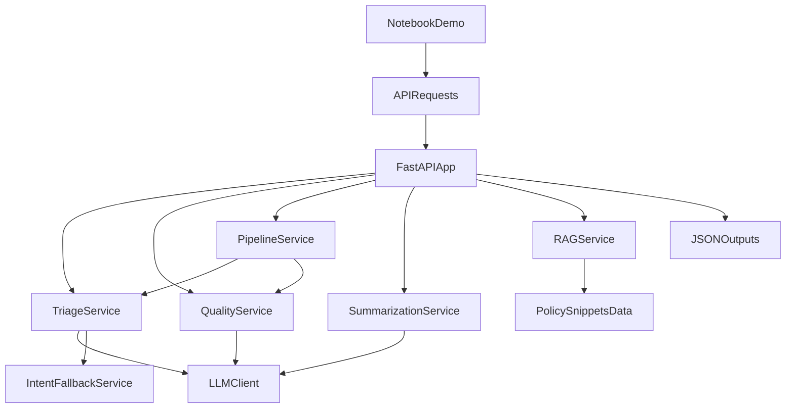

# Project File Map

This map explains what each folder/file in `llm-assist` does and how components integrate.

## Integration flow

## Top-level files and folders

- `.env` — local runtime config with secrets (local-only).
- `.env.example` — template config for reproducible setup.
- `.gitignore` — ignore rules for generated artifacts/secrets/caches.
- `.github/workflows/ci.yml` — CI checks (lint/type/tests/docker smoke).
- `pyproject.toml` — dependencies + pytest/ruff/mypy config.
- `Dockerfile` — containerized API build.
- `docker-compose.yml` — local stack orchestration (API + Redis + optional observability).
- `README.md` — primary setup/API architecture reference.
- `sample_payloads.json` — endpoint demo inputs.
- `literature_review.md` — supporting write-up.
- `LlmCustomerSupport_project_report (2).pdf` — project report artifact.

## `app/` (runtime source code)

- `main.py` — FastAPI app startup, middleware, route registration.
- `api/v1/routers.py` — all HTTP endpoints (`/triage`, `/quality`, `/pipeline`, `/summarize`, `/rag/context`, `/health`).
- `api/v1/errors.py` — centralized exception -> HTTP response translation.
- `core/config.py` — typed settings from env vars (`LLM_PROFILE`, thresholds, feature flags).
- `core/dependencies.py` — singleton dependency wiring for services.
- `core/exceptions.py` — domain-specific error classes.
- `core/logging.py` — structured logging setup.
- `models/domain.py` — Pydantic API/domain contracts and enums.
- `services/llm_client.py` — provider abstraction, retries, JSON parsing.
- `services/triage_service.py` — triage prompt/orchestration/routing.
- `services/intent_fallback_service.py` — synonym + embedding fallback for invalid labels.
- `services/quality_service.py` — quality rubric evaluation.
- `services/pipeline_service.py` — concurrent triage+quality orchestration.
- `services/summarization_service.py` — conversation summary generation.
- `services/rag_service.py` — lexical/embedding retrieval over policy snippets.
- `services/triage_transformer_predict.py` — optional transformer hint inference.
- `integrations/zendesk_worker.py` — integration stub/CLI for Zendesk flow.
- `utils/cache.py` — Redis-backed response cache.
- `utils/metrics.py` — Prometheus metric primitives.

## `tests/` (quality assurance)

- `tests/unit/` — service/config behavior checks (including fallback and label recovery).
- `tests/integration/test_api.py` — endpoint integration coverage.
- `tests/integration/test_pipeline_e2e.py` — deterministic full pipeline smoke.
- `tests/integration/test_pipeline_label_recovery.py` — invalid-label recovery path.
- `tests/conftest.py` — shared fixtures/env isolation.

## `scripts/` (offline operations)

- `run_offline_eval.py` — metrics generation from golden set.
- `run_eda.py` — EDA output generation.
- `train_encoder_classifier.py` — classical TF-IDF/LR baseline training.
- `train_triage_transformer.py` — optional BERT/RoBERTa fine-tuning pipeline.

## `evaluation/` (metrics/util package)

- `metrics.py` — metric computations used by evaluation scripts.
- `correlation.py` — analysis helpers.
- `splits.py` — dataset split utilities.
- `eda_loaders.py` — EDA data loading utilities.

## `data/` (inputs and fixtures)

- `policy_snippets.json` — local policy corpus for grounding.
- `golden/eval_set.jsonl` — deterministic evaluation dataset.
- `fixtures/zendesk_ticket.json` — integration fixture.
- `download_kaggle.py` — external dataset fetch helper.
- `README.md` — data lineage and usage notes.

## `notebooks/` (demo notebooks)

- `llm_assist_showcase.ipynb` — end-to-end demo walkthrough.
- `README.md` — notebook run instructions and caveats.

## `docs/` (presentation and methodology)

- `IMPLEMENTATION_REPORT.md` — implementation narrative.
- `METHODOLOGY_EDA_AND_DL.md` — methodology and experiments.
- `DATASETS.md` — dataset options and provenance.
- `ALIGNMENT_READINESS.md` — claims/evidence and demo readiness.
- `VERIFICATION_REPORT.md` — run verification outcomes.
- `CLAIMS_EVIDENCE_MATRIX.md` — claim-by-claim evidence mapping.
- `IMPLEMENTATION_CHANGELOG.xlsx` — change tracking.
- `spec.pdf` / `claude_code_setup.md` — supporting references.

## Generated/local-only folders (not source-of-truth)

- `.venv/` — local Python environment.
- `.pytest_cache/`, `.mypy_cache/`, `.ruff_cache/` — tool caches.
- `.coverage` — coverage database.
- `support_triage.egg-info/` — packaging metadata.
- `artifacts/` — generated outputs (model checkpoints, eval results, EDA charts).
- `.DS_Store` — macOS metadata files.
